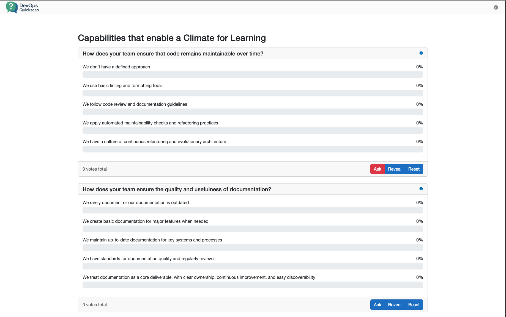
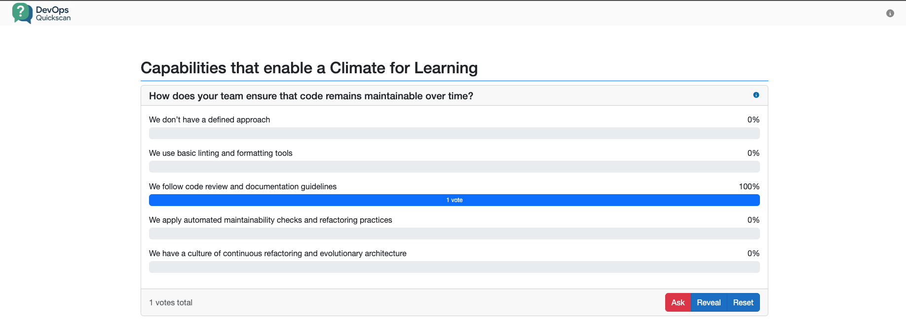
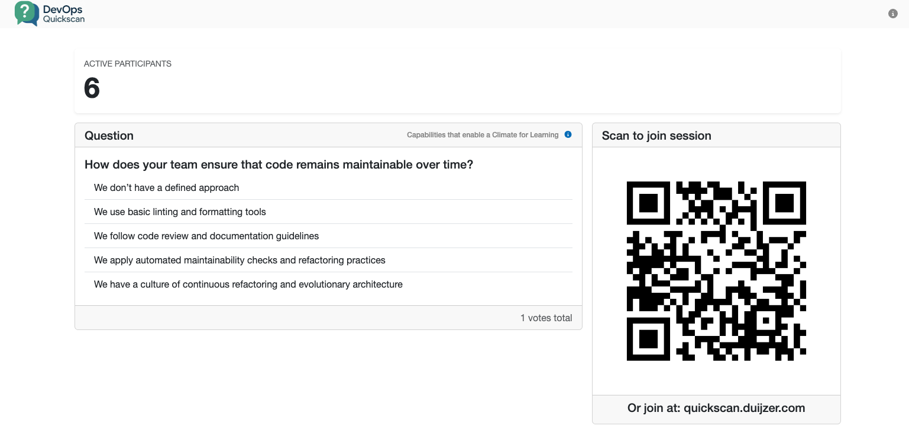
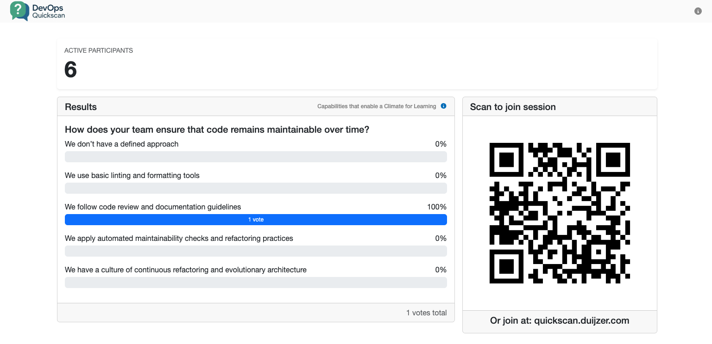
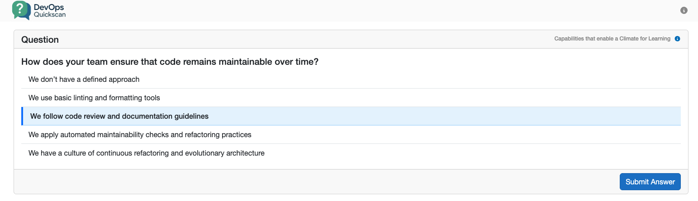
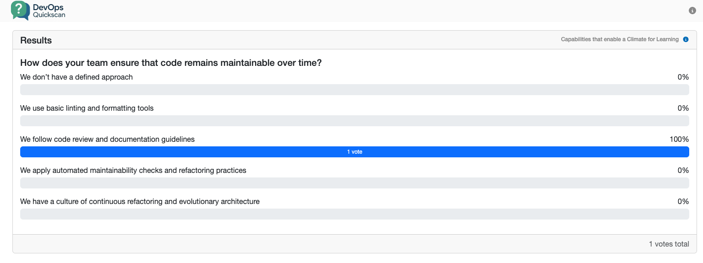

[](https://github.com/jacobduijzer/DevOpsQuickScan/actions/workflows/ci.yml) [](https://github.com/jacobduijzer/DevOpsQuickScan/actions/workflows/docker-image.yml) [](https://github.com/jacobduijzer/DevOpsQuickScan/actions/workflows/infra-as-code.yml)

# DevOps QuickScan

A lightweight, real-time questionnaire tool to spark meaningful conversations and improvements in your engineering
team—based on the DORA.dev capabilities.

## Use Cases

* Engineering team off-sites
* Internal DevOps health checks
* Retrospectives
* Continuous improvement rituals

## Features

* ✅ Real-time feedback with SignalR
* 📊 Five-point Likert scale questions (from “bad” to “very good”)
* 🔗 Linked to official DORA capabilities
* 🧰 Easy to self-host via Docker
* 🖥️ Built with .NET + Razor

### Facilitator Views 

The facilitator can see al available questions, select them, control the flow of the session, reveal answers, and export results.

<a href="./docs/images/quickscan-facilitator-1.png"></a>

The facilitator can also see the answers coming in, in real-time, when participants are answering the questions.

<a href="./docs/images/quickscan-facilitator-2.png"></a>

### Dashboard View

The dashboard view is designed for large screens, showing the current question or results with a QR code to join.

<a href="./docs/images/quickscan-participant-2.png"></a>

Revealed answers are shown in a clear and engaging manner, to help facilitate discussions.

<a href="./docs/images/quickscan-participant-3.png"></a>

### Participant Views

Participants can view and answer questions on their own devices.

<a href="./docs/images/quickscan-participant-1.png"></a>

They can see the overall results after each question is revealed.

<a href="./docs/images/quickscan-participant-4.png"></a>

## Getting Started

Prerequisites

* .NET 8 SDK (for development only)
* Docker
* (Optional) Azure for deployment

### Docker

```bash
    docker run -p 8080:8080 jacobduijzer/devops-quickscan:latest
```

| Role        | Url                               | Description                                                                                  |
|-------------|-----------------------------------|----------------------------------------------------------------------------------------------|
| Facilitator | http://localhost:8080/facilitator | Select questions, control the flow, reveal answers, and export results.                      |
| Dashboard   | http://localhost:8080/dashboard   | A display for large screens, showing the current question or results with a QR code to join. |
| Participant | http://localhost:8080/            | Where team members answer the questions and see live results.                                |

### Local run

```bash
    cd src/DevOpsQuickScan.BlazorApp
    dotnet run
```

Then open the appropriate URL based on your role:

| Role        | Url                               | Description                                                                                  |
|-------------|-----------------------------------|----------------------------------------------------------------------------------------------|
| Facilitator | http://localhost:5119/facilitator | Select questions, control the flow, reveal answers, and export results.                      |
| Dashboard   | http://localhost:5119/dashboard   | A display for large screens, showing the current question or results with a QR code to join. |
| Participant | http://localhost:5119/            | Where team members answer the questions and see live results.                                |

### Local Docker

```bash
    docker build -t devops-quickscan .
    docker run -p 8080:8080 devops-quickscan
```

| Role        | Url                               | Description                                                                                  |
|-------------|-----------------------------------|----------------------------------------------------------------------------------------------|
| Facilitator | http://localhost:8080/facilitator | Select questions, control the flow, reveal answers, and export results.                      |
| Dashboard   | http://localhost:8080/dashboard   | A display for large screens, showing the current question or results with a QR code to join. |
| Participant | http://localhost:8080/            | Where team members answer the questions and see live results.                                |

## Todo / Wishlist

- [ ] Create documentation about how to use your own questions
- [ ] Store sessions, to continue later
- [ ] Support multiple sessions simultaneously
- [ ] Protect the facilitator page(s)
- [ ] Better reporting

## Inspired By

* [DORA.dev](https://dora.dev) - DevOps Research and Assessment Website

