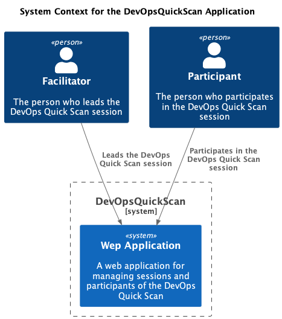
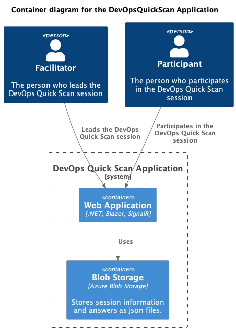
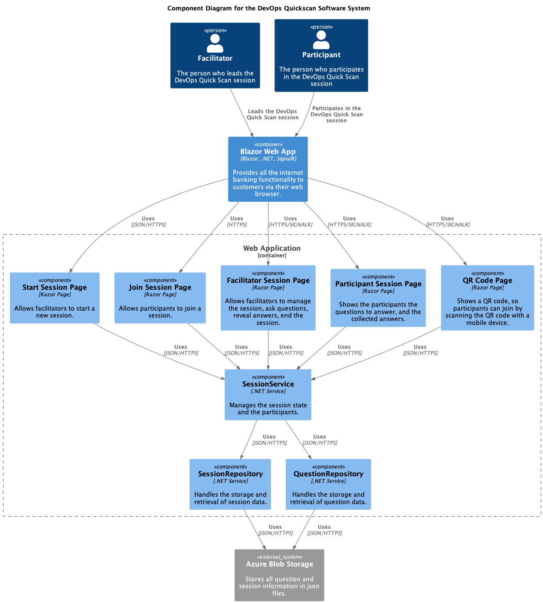
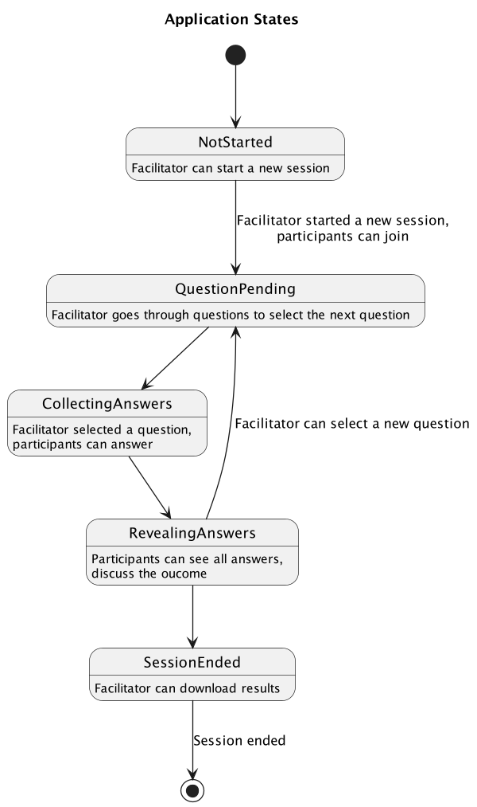
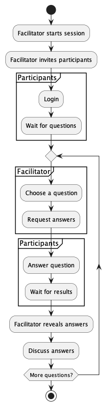
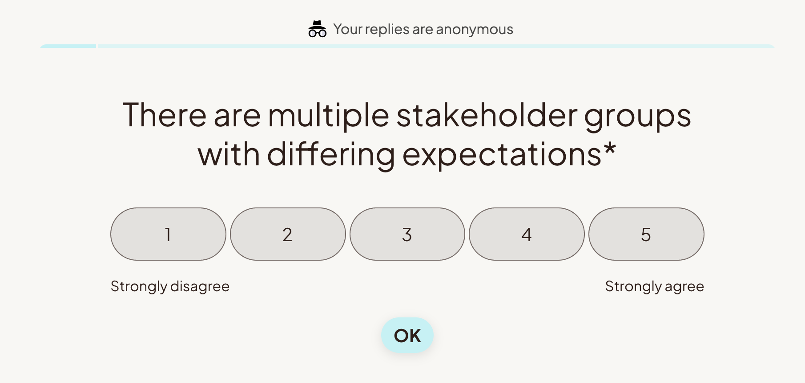

# DevOps QuickScan

## Introduction

This application can be used as a driver for conversations regarding the state of DevOps within your team(s) or your organization. You can use it when you are starting as a new Engineer, as a Agile or DevOps Coach, as an Engineering Manager, or as a Staff Engineer. 

The goal is to have good conversations around the capabilities as defined by [DORA](https://dora.dev). 

## Features

* The application can run from Docker, or as a web application.
* There is no storage, the results can be exported as a report.
* Questions can be changed, added, or removed, by simply editing a json file.

## Glossary

- Survey: a set of questions and answers. These survey can be used to start a new session, where participants can answer the questions.
- Session: a session is a live activity where a group of participants answer a predefined set of questions (a survey) together.
- Participant: a participant is a person participating in a session, answering the questions from a survey together.
- Facilitator: a facilitator can create surveys, start sessions, invite participants, and, in the future, create reports and compare the results of sessions.

## Architecture

### System Context

### Container Diagram

### Component Diagram

## State diagram

## The flow of the application

## Ideas

Hosting in Azure / Cloud environment, with a light-weight data solution.
Storing questions and sessions together.
Admin can create a session, adds questions, invite people.
People can answer questions, admin can see answers and reveal answers.
People can rejoin by using the link.
Admin is in control of which question is visible and if the answers are visible.

## TODO List

- [ ] Reveal answers
- [ ] Admin start session? Or request the current question when joining
- [ ] 

